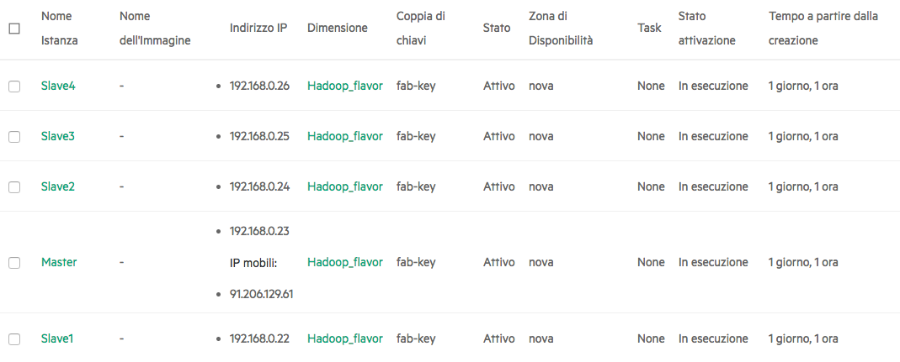

SETUP AND CONFIGURATION OF OPENVPN SERVER ON A CENTOS 7.3 CLUSTER
===================
## Cluster configuration
We had a cluster of five centos instances belonging to the same sub-network (i.e. CIDR 192.168.0.0/24). 

Moreover, we need the root access to the openvpn server and configure the cluster network in the way to open the ports 22 (for ssh) and 443 (for openvpn). 

OpenVPN offers two methods of creating this pipe:
 
 - via *Network Bridging*, it creates a virtual tap device, which it pretends is connected to the remote network (such as, via an imaginary Ethernet cable). In this case machines belonging to sub-networks having same ip subnet (eg 10.0.0.0/24) on both ends of the vpn can reach each others, without any changes in their routing tables.  
 - via *Routing*, OpenVPN create a virtual device, called tun, which translating a fictitious address to a real address (i.e. doing as Network Address Translation). When a client connects via routing, it uses its own separate subnet, and routes are set up on both the client machine and remote gateway so that data packets will seamlessly traverse the VPN. The "client" is not necessarily a single machine. It could be a subnet of several machines.

You’ll notice that while the tap device doesn’t actually change the packets flowing through it, the tun device actively writes routing information in each packet. Because of this behaviour, the tap/tun device is in fact acting totally differently than it was in the bridged network scenario. There, it was acting as a network bridge, and here it is acting as a router – therein lies the difference between the two methods of building a secure pipe supported by OpenVPN.

For further information see [[1]](http://www.aminutestime.com/blog/articles/an-openvpn-primer/) and [[2]](https://community.openvpn.net/openvpn/wiki/BridgingAndRouting) 

## Install OpenVpn server

The first step consists to install the [EPEL Repo](https://fedoraproject.org/wiki/EPEL/it), [OpenVPN and Easy-RSA](https://openvpn.net/easyrsa.html) :

    $ yum update
    $ yum install epel-release
    $ yum install openvpn easy-rsa
    
## Initial OpenVPN Configuration
Copy the certificate generation scripts from their default location to our OpenVPN folder.

    $ cp -rf /usr/share/easy-rsa/2.0/* /etc/openvpn/easy-rsa
    
Go to the easy-rsa directory and source the variables.

    $ cd /etc/openvpn/easy-rsa
    $ source ./vars
    
Then clean all the existing keys & certificates (if any) and generate the new certificate authority.

    ./clean-all

## Generate certificates 
Create a folder so we can store the keys and certificates:    

    $ mkdir -p /etc/openvpn/easy-rsa/keys
Build a certificate authority. It will be asked several information. You can fill in your information or to leave it as it is you can just press enter.

    ./build-ca
    
Generate the keys and certificates for the OpenVPN server. You will be again asked the same questions as the above command which you can fill in or ignore by just pressing the enter key. From the below command, we will create the keys and certificates with the filename of server. After entering your information, you will be asked to Sign the Certificate, press "y" to approve.

    ./build-key-server server
Therefore, create a Diffie-Hellman file. Creation of this file will depends on the length of the key. 

    ./build-dh
Now, we have to configure the OpenVPN server. We create a new file */etc/openvpn/server.conf* having the following configuration details:

    port 443
    proto tcp
    dev tun
    server 192.168.100.0 255.255.255.0
    ca /etc/openvpn/easy-rsa/keys/ca.crt
    cert /etc/openvpn/easy-rsa/keys/server.crt
    key /etc/openvpn/easy-rsa/keys/server.key 
    dh /etc/openvpn/easy-rsa/keys/dh2048.pem
    persist-key
    persist-tun 
    keepalive 10 60
    reneg-sec 0
    comp-lzo
    tun-mtu 1468
    tun-mtu-extra 32
    mssfix 1400
    push "persist-key"
    push "persist-tun"
    push "dhcp-option DNS 8.8.8.8"
    push "dhcp-option DNS 8.8.4.4" 
    push "route 192.168.100.0 255.255.255.0"
    push "route 192.168.0.0 255.255.255.0"
    status /etc/openvpn/443.log
    verb 3
 
Next we need to run and enable OpenVPN on startup.

    systemctl start openvpn@server.service
    systemctl -f enable openvpn@server.service

### Generate client certificates
To generate a certificate for our client, e.g. Fabiana, run the following command:

    cd /etc/openvpn/easy-rsa
    ./build-key fabiana
    
The files *fabiana.crt*, *fabiana.key* , "ca.crt" must be downloaded to the client.
In the client machine at the same path of the above files create the file *client.ovpn*, having the following data:

    client
    remote 91.206.129.61 443
    proto tcp
    resolv-retry infinite
    route-delay 2
    pull
    comp-lzo yes
    dev tun
    nobind
    ca ca.crt
    cert fabiana.crt
    key fabiana.key

## Routing & Forwarding rules

Some iptables rules are needed on the vpn server to enable routing:

     iptables -t nat -o eth0 -A POSTROUTING -j MASQUERADE

The above rule is not permanently added. Therefore, each time the machine is rebooted you must redo this instruction.

**Note** This [link](https://docs.openvpn.net/troubleshooting/troubleshooting-reaching-systems-over-the-vpn-tunnel/) is an interesting tutorial about how to check routing problems.
     
Finally,  edit systctl.conf to enable packet forwarding. Open the file */etc/sysctl.conf* and add the following line:

    net.ipv4.ip_forward=1
Then, run:

    sysctl -p

 ##Connect to the VPN
 ### From MAC
 Download [Tunnelblick](https://tunnelblick.net/downloads.html). **Note**,  make sure that the 4 files required are in the same folder.

    
## References
[1] http://www.aminutestime.com/blog/articles/an-openvpn-primer/   
[2] https://community.openvpn.net/openvpn/wiki/BridgingAndRouting 
[3] https://www.digitalocean.com/community/tutorials/how-to-setup-and-configure-an-openvpn-server-on-centos-6
[4] https://www.vpsserver.com/community/tutorials/7/setup-and-configuration-of-openvpn-server-on-centos-7-2/
[5] https://docs.openvpn.net/troubleshooting/troubleshooting-reaching-systems-over-the-vpn-tunnel/
